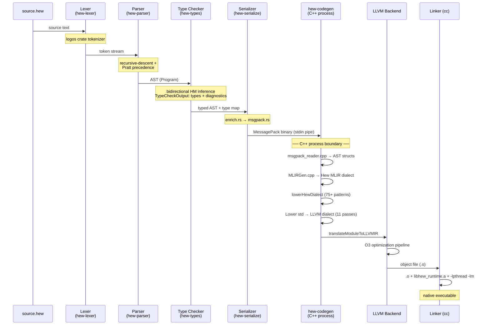
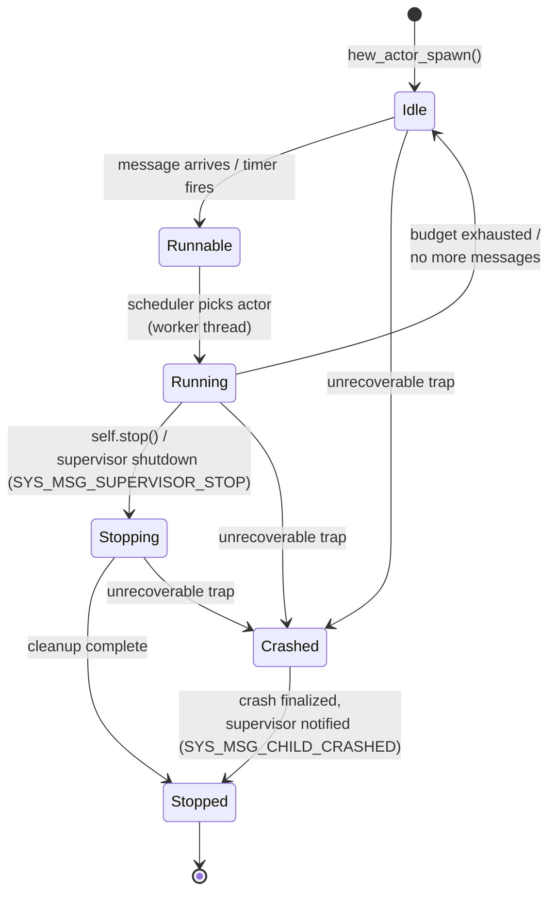
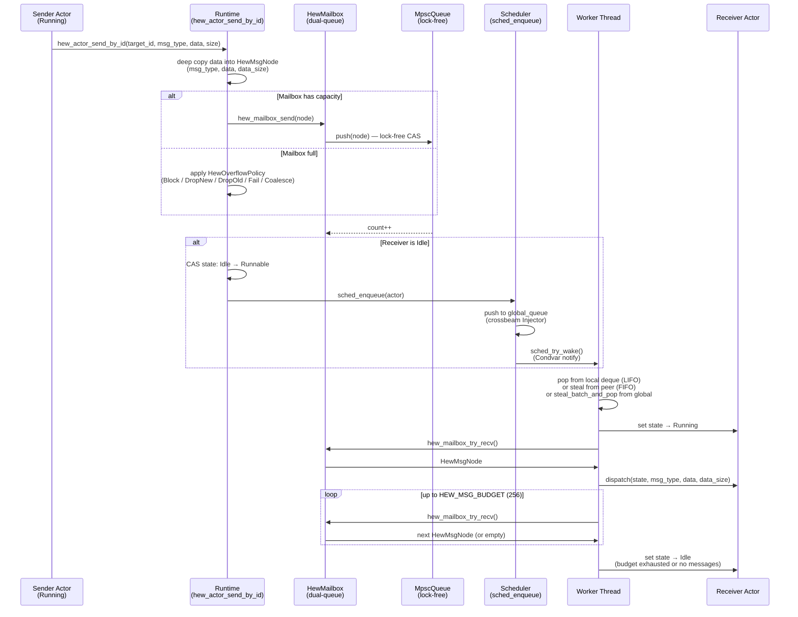
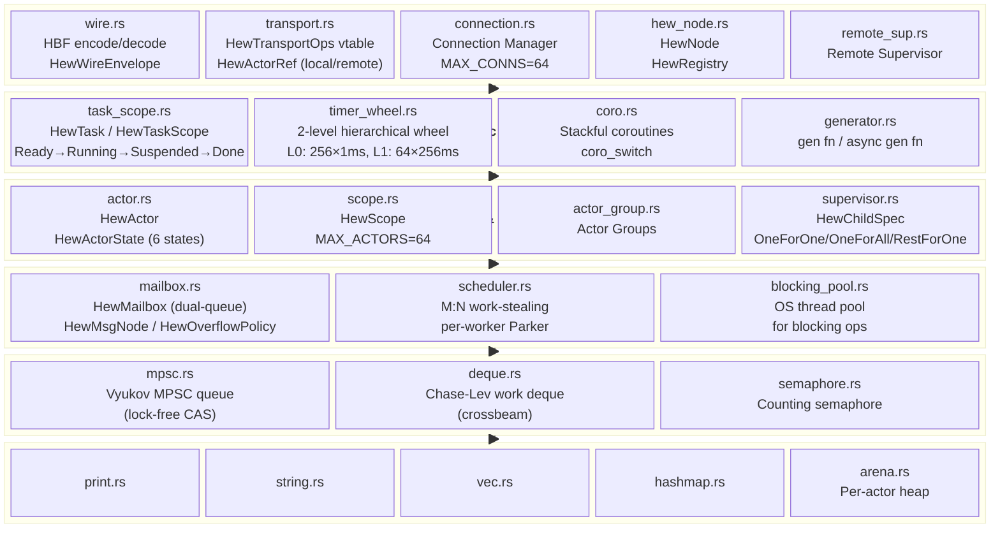
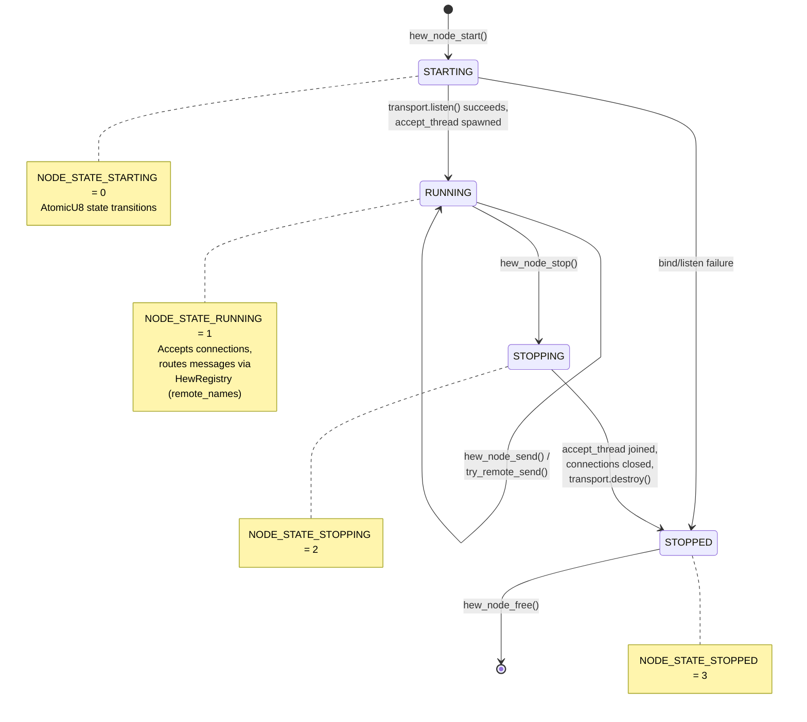
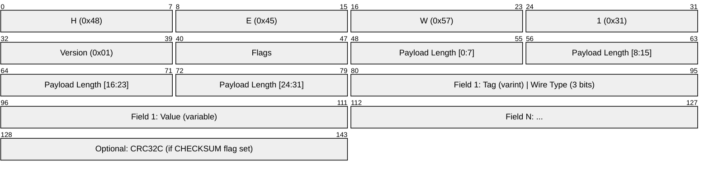
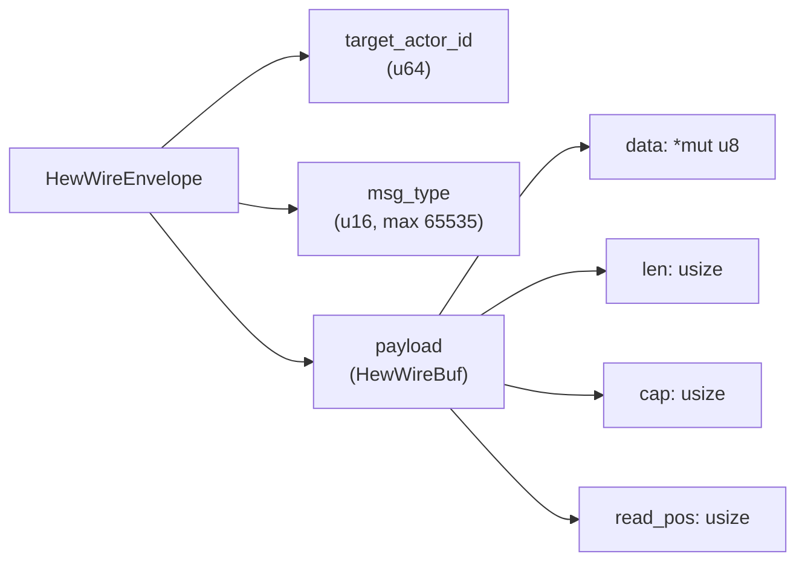
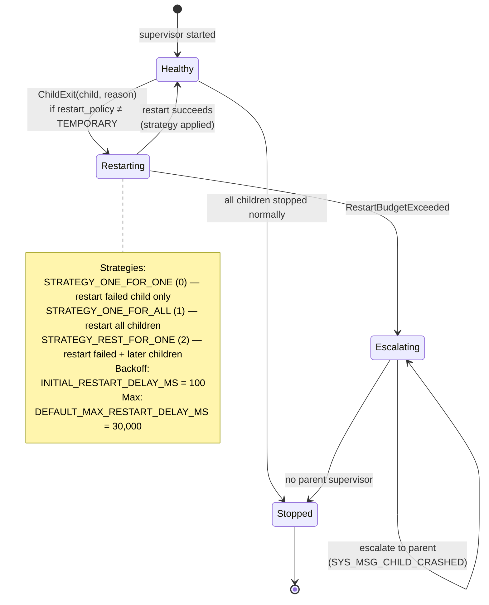

# Hew Compiler & Runtime Diagrams

Visual documentation of the Hew compilation pipeline, runtime architecture, and protocol formats using Mermaid diagrams. These diagrams reflect the actual codebase structure — function names, module names, constants, and data types are taken directly from source.

> **Rendering:** These diagrams use [Mermaid](https://mermaid.js.org/) syntax. GitHub renders them natively in Markdown. For local viewing, use a Mermaid-compatible Markdown previewer or the [Mermaid Live Editor](https://mermaid.live/).

---

## 1. Compilation Pipeline

The compiler has two process boundaries: a **Rust frontend** (lexer → parser → type checker → serializer) and a **C++ backend** (MLIR generation → lowering → LLVM → native code). They communicate via MessagePack over stdin.



**Compiler flags for partial pipeline:**

- `--no-typecheck` — skip type checking
- `--emit-mlir` — stop after MLIR generation
- `--emit-llvm` — stop after LLVM IR translation
- `--emit-obj` — stop after object file emission

---

## 2. Actor Lifecycle State Machine

Governs the lifecycle of each actor instance within the runtime scheduler. Defined in `hew-runtime/src/actor.rs` as `HewActorState`. This is distinct from the per-task state machine (§4.1 in the spec).



**Preemption budget (3-level hierarchy):**

| Level             | Budget                                       | Mechanism                                                          |
| ----------------- | -------------------------------------------- | ------------------------------------------------------------------ |
| Message budget    | `HEW_MSG_BUDGET = 256` messages/activation   | Coarse scheduler preemption — yield after 256 messages             |
| Reduction budget  | `HEW_DEFAULT_REDUCTIONS = 4000` per dispatch | Compiler-inserted `cooperate` calls at loop headers and call sites |
| Cooperative yield | Per-coroutine                                | `coro_switch` on `await` within `s.launch` tasks                   |

**Actor dispatch signature** (§9.1.1):

```c
void (*dispatch)(void* state, int msg_type, void* data, size_t data_size);
```

---

## 3. MLIR Lowering Pipeline

The codegen pipeline in `hew-codegen/src/codegen.cpp` performs progressive lowering through multiple stages. The Hew dialect defines ~50 custom operations across actor, collection, generator, scope, and trait categories.

```mermaid
flowchart TD
    A["MessagePack AST<br/>(from Rust frontend via stdin)"] --> B["MLIRGen.cpp<br/>→ Hew MLIR Dialect"]

    B --> PRE["<b>Pre-Lowering Optimization</b>"]

    PRE --> C1["Canonicalize"]
    PRE --> C2["DevirtualizeTraitDispatchPass<br/><i>direct-call when vtable is static</i>"]
    PRE --> C3["Canonicalize"]
    PRE --> C4["StackPromoteDynCoercionPass<br/><i>arena.malloc → alloca for confined ptrs</i>"]

    C1 --> C2 --> C3 --> C4

    C4 --> STAGE1["<b>Stage 1: Lower Hew Dialect</b><br/>75+ ConversionPatterns<br/>(applyPartialConversion)"]

    STAGE1 --> S1_DETAIL["Actor: SpawnOp, SendOp, AskOp, StopOp …<br/>Collections: VecNewOp, HashMapInsertOp …<br/>Generators: GenCtxCreateOp, GenYieldOp …<br/>Scope/Task: ScopeCreateOp, TaskSetResultOp …<br/>Select: SelectCreateOp, SelectFirstOp …<br/>Traits: TraitDispatchOp → func.CallOp<br/>Closures: ClosureCreateOp, ClosureGetFnOp …"]

    S1_DETAIL --> STAGE2["<b>Stage 2: Lower to LLVM Dialect</b><br/>(11 core passes)"]

    STAGE2 --> P1["1. Canonicalize + CSE"]
    P1 --> P2["2. SCFToControlFlow<br/><i>scf.if/for/while → cf.br/cond_br</i>"]
    P2 --> P3["3. ConvertFuncToLLVM<br/><i>func.func → llvm.func</i>"]
    P3 --> P4["4. VtableGlobalPass<br/><i>VtableRefOp → llvm.GlobalOp + AddressOfOp</i>"]
    P4 --> P5["5. InternalLinkagePass<br/><i>hide non-main funcs</i>"]
    P5 --> P6["6. SetTailCallsPass<br/><i>hew.tail_call → LLVM tail call</i>"]
    P6 --> P7["7. ArithToLLVM"]
    P7 --> P8["8. ConvertControlFlowToLLVM"]
    P8 --> P9["9. FinalizeMemRefToLLVM"]
    P9 --> P10["10. ReconcileUnrealizedCasts"]
    P10 --> P11["11. Canonicalize (cleanup)"]

    P11 --> STAGE3["<b>Stage 3: Translate to LLVM IR</b><br/>mlir::translateModuleToLLVMIR"]

    STAGE3 --> OPT["LLVM O3 Pipeline<br/>(skipped with --debug-info)"]
    OPT --> OBJ["Object File (.o)<br/>TargetMachine::addPassesToEmitFile"]
```



**Type converter mappings** (Hew → LLVM):

| Hew Type                                            | LLVM Type                                |
| --------------------------------------------------- | ---------------------------------------- |
| `ActorRef`, `StringRef`, `Vec`, `HashMap`, `Handle` | `!llvm.ptr`                              |
| `HewTuple`                                          | `!llvm.struct<...>`                      |
| `HewArray`                                          | `!llvm.array<N x T>`                     |
| `TraitObject`                                       | `!llvm.struct<ptr, ptr>` (data + vtable) |
| `Closure`                                           | `!llvm.struct<ptr, ptr>` (fn + env)      |
| `OptionEnum`                                        | `!llvm.struct<i32, T>`                   |
| `ResultEnum`                                        | `!llvm.struct<i32, OK, ERR>`             |

---

## 4. Actor Message Flow

Shows the internal mechanics of sending a message between actors. Deep-copy semantics ensure actor isolation — no shared memory between actors.



**Mailbox internals** (`hew-runtime/src/mailbox.rs`):

- Dual-queue design: fast lock-free MPSC (Vyukov queue) + slow Mutex-guarded VecDeque
- Configurable `HewOverflowPolicy`: Block, DropNew, DropOld, Fail, Coalesce
- Optional `coalesce_key_fn` for in-place message replacement

---

## 5. Runtime Architecture

Layered architecture of `libhew_runtime.a` (`hew-runtime/src/`). All layers export C ABI functions via `#[no_mangle] extern "C"`.



**Key constants:**

| Constant                 | Value  | Source         |
| ------------------------ | ------ | -------------- |
| `HEW_MSG_BUDGET`         | 256    | `actor.rs`     |
| `HEW_DEFAULT_REDUCTIONS` | 4000   | `actor.rs`     |
| `HEW_MAX_WORKERS`        | 256    | `actor.rs`     |
| `HEW_SCOPE_MAX_ACTORS`   | 64     | `scope.rs`     |
| `MAX_CONNS`              | 64     | `transport.rs` |
| `MAX_FRAME_SIZE`         | 16 MiB | `transport.rs` |
| `PARK_TIMEOUT`           | 10 ms  | `scheduler.rs` |

---

## 6. Distributed Node State Machine

Governs the lifecycle of a `HewNode` in distributed mode (`hew-runtime/src/hew_node.rs`). Each node has a `node_id: u16`, a bound address, and a transport vtable.



**Node components:**

- `HewRegistry` — maps string names to remote actor IDs
- `HewTransportOps` — vtable: `connect`, `listen`, `accept`, `send`, `recv`, `close_conn`, `destroy`
- `HewActorRef` — discriminated union: `ACTOR_REF_LOCAL(0)` or `ACTOR_REF_REMOTE(1)`
- `next_peer_node` — auto-incrementing connection ID counter

---

## 7. Wire Protocol Frame Format (HBF)

The Hew Binary Format is the internal wire encoding for distributed actor messaging. Defined in `hew-runtime/src/wire.rs` and specified in §7.3.1 of the language spec.



**Header structure** (`HBF_HEADER_LEN = 10` bytes):

| Offset | Size | Field   | Value                                      |
| ------ | ---- | ------- | ------------------------------------------ |
| 0      | 4    | Magic   | `HBF_MAGIC = "HEW1"` (0x48 0x45 0x57 0x31) |
| 4      | 1    | Version | `HBF_VERSION = 0x01`                       |
| 5      | 1    | Flags   | `HBF_FLAG_COMPRESSED = 0x01` (LZ4)         |
| 6      | 4    | Length  | Payload length (little-endian u32)         |

**Wire types** (3-bit field in tag):

| Value | Name             | Constant                     | Description                      |
| ----- | ---------------- | ---------------------------- | -------------------------------- |
| 0     | VARINT           | `WIRE_TYPE_VARINT`           | Unsigned LEB128, self-delimiting |
| 1     | FIXED64          | `WIRE_TYPE_FIXED64`          | Always 8 bytes                   |
| 2     | LENGTH_DELIMITED | `WIRE_TYPE_LENGTH_DELIMITED` | Varint length prefix + bytes     |
| 5     | FIXED32          | `WIRE_TYPE_FIXED32`          | Always 4 bytes                   |

**Tag encoding:** `(field_number << 3) | wire_type`

**Envelope structure** (`HewWireEnvelope`):



**Signed integers** use zigzag encoding: `zigzag(n) = (n << 1) ^ (n >> 63)`

---

## 8. Supervisor State Machine

Supervisors manage child actor lifecycles with configurable restart strategies. Defined in `hew-runtime/src/supervisor.rs`.



**Restart policies** (`HewChildSpec.restart_policy`):

| Policy              | Value | Behavior                                |
| ------------------- | ----- | --------------------------------------- |
| `RESTART_PERMANENT` | 0     | Always restart                          |
| `RESTART_TRANSIENT` | 1     | Restart only on crash (not normal stop) |
| `RESTART_TEMPORARY` | 2     | Never restart                           |

**System messages:**

| Message                   | Value | Trigger                     |
| ------------------------- | ----- | --------------------------- |
| `SYS_MSG_CHILD_STOPPED`   | 100   | Child stopped normally      |
| `SYS_MSG_CHILD_CRASHED`   | 101   | Child crashed               |
| `SYS_MSG_SUPERVISOR_STOP` | 102   | Supervisor shutdown command |
| `SYS_MSG_EXIT`            | 103   | Exit signal                 |
| `SYS_MSG_DOWN`            | 104   | Monitored actor down        |

---

## Cross-References

- **Language specification:** [`docs/specs/HEW-SPEC.md`](specs/HEW-SPEC.md) — §8 (Compilation Model), §9 (Runtime Model)
- **Runtime source:** [`hew-runtime/src/`](../hew-runtime/src/)
- **Codegen source:** [`hew-codegen/src/`](../hew-codegen/src/)
- **Wire format spec:** HEW-SPEC.md §7.3.1 (HBF encoding)
