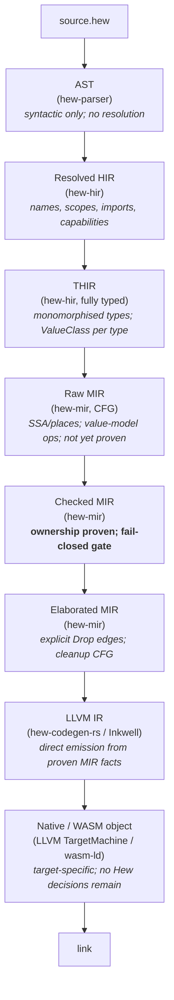
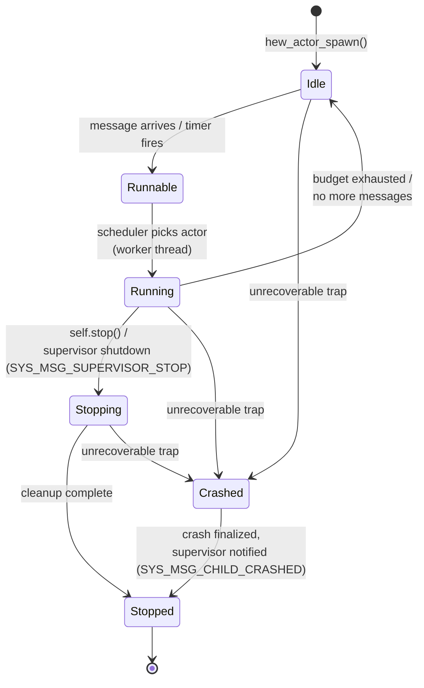
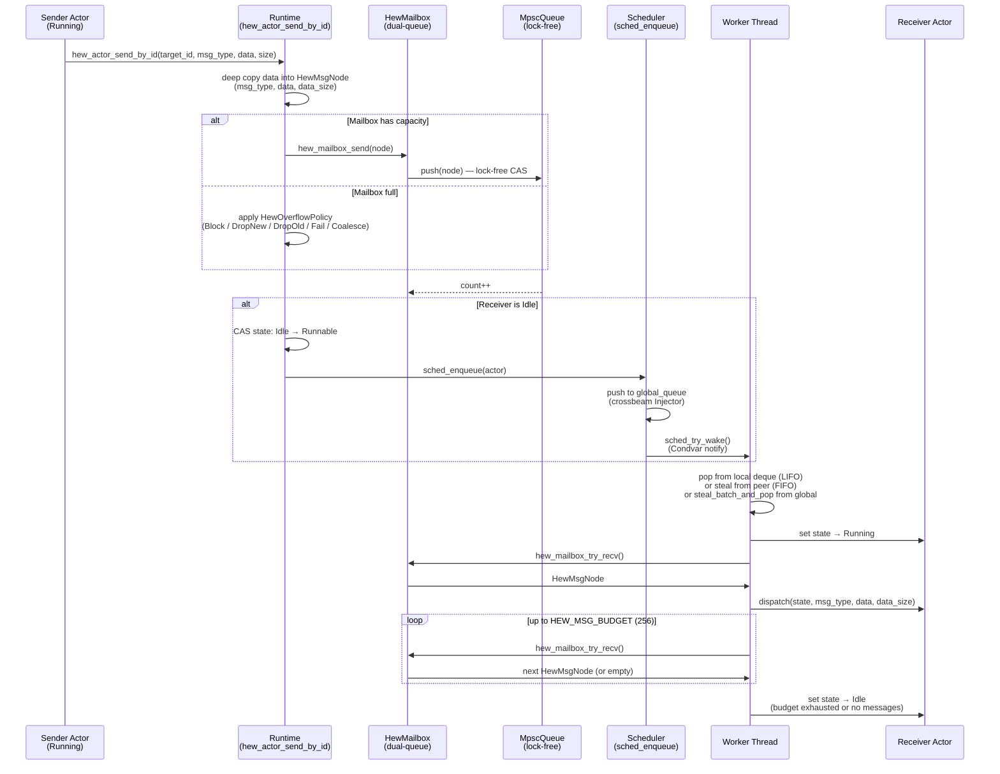
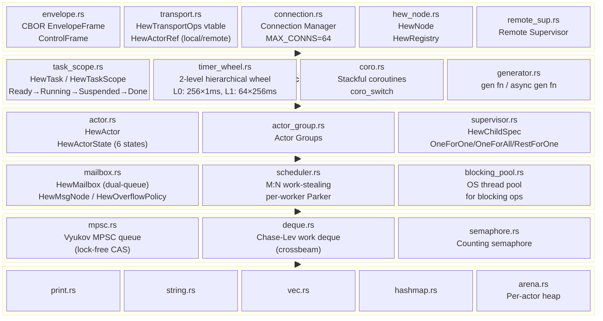
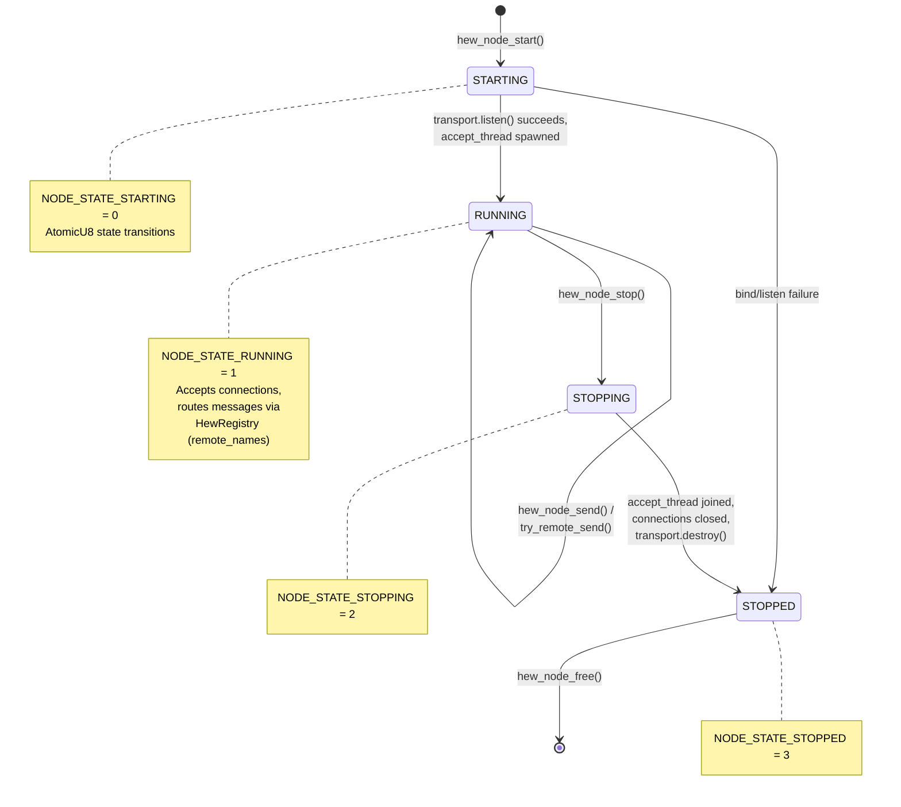
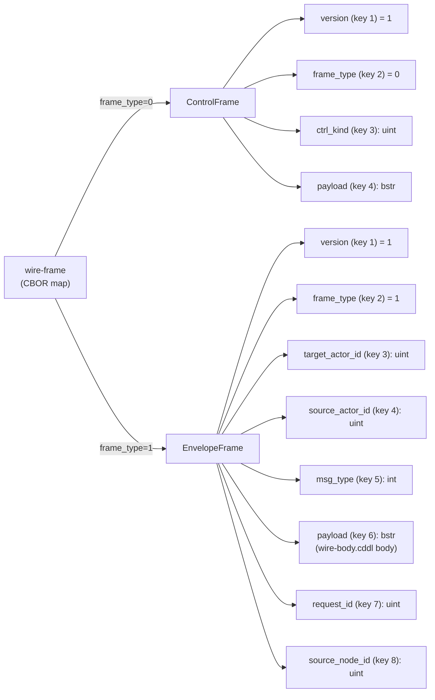
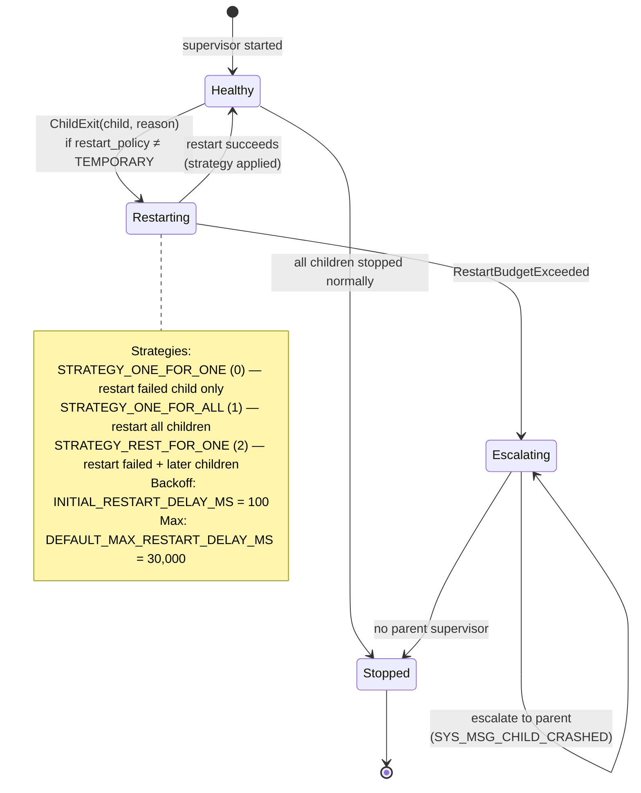

# Hew Compiler & Runtime Diagrams

Visual documentation of the Hew compilation pipeline, runtime architecture, and
protocol formats using Mermaid diagrams. Every diagram reflects the current v0.5
codebase.

> **Rendering:** These diagrams use [Mermaid](https://mermaid.js.org/) syntax. GitHub renders them natively in Markdown. For local viewing, use a Mermaid-compatible Markdown previewer or the [Mermaid Live Editor](https://mermaid.live/).

---

## 1. Compilation Pipeline

Hew compiles through an explicit IR ladder. Each layer has a distinct owner, a
verifier or diagnostic class, and a deterministic text dump. Ownership is proven
in Checked MIR (a fail-closed gate); the Rust/Inkwell backend lowers proven MIR
facts directly into LLVM IR and re-derives no semantics. See
[`docs/internal/v05-ir-ladder.md`](internal/v05-ir-ladder.md) for the per-layer
contracts.


```mermaid
flowchart TD
    SRC["source.hew"] --> AST["AST<br/>(hew-parser)<br/><i>syntactic only; no resolution</i>"]
    AST --> HIR["Resolved HIR<br/>(hew-hir)<br/><i>names, scopes, imports, capabilities</i>"]
    HIR --> THIR["THIR<br/>(hew-hir, fully typed)<br/><i>monomorphised types; ValueClass per type</i>"]
    THIR --> RMIR["Raw MIR<br/>(hew-mir, CFG)<br/><i>SSA/places; value-model ops; not yet proven</i>"]
    RMIR --> CMIR["Checked MIR<br/>(hew-mir)<br/><b>ownership proven; fail-closed gate</b>"]
    CMIR --> EMIR["Elaborated MIR<br/>(hew-mir)<br/><i>explicit Drop edges; cleanup CFG</i>"]
    EMIR --> LLVM["LLVM IR<br/>(hew-codegen-rs / Inkwell)<br/><i>direct emission from proven MIR facts</i>"]
    LLVM --> OBJ["Native / WASM object<br/>(LLVM TargetMachine / wasm-ld)<br/><i>target-specific; no Hew decisions remain</i>"]
    OBJ --> LINK["link"]
```

**Current v0.5 inspection commands:**

- `hew compile --dump-mir raw|checked|elab <file.hew>` — inspect the MIR ladder without LLVM emission
- `hew compile --emit-dir <dir> <file.hew>` — write LLVM/object/WASM artefacts for the Rust codegen path
- `hew machine diagram [--format mermaid|graphviz|json] <file.hew>` — render machine declarations
- `hew machine list <file.hew>` — list machines, states, and events

The retired C++/MLIR flags (`--emit-mlir`, `--emit-llvm`, `--emit-obj`) are not available in v0.5.

---

## 2. Actor Lifecycle State Machine

Governs the lifecycle of each actor instance within the runtime scheduler. Defined in `hew-runtime/src/actor.rs` as `HewActorState`. This is distinct from the per-task state machine (§4.1 in the spec).


```mermaid
stateDiagram-v2
    [*] --> Idle: hew_actor_spawn()

    Idle --> Runnable: message arrives / timer fires
    Runnable --> Running: scheduler picks actor<br/>(worker thread)
    Running --> Idle: budget exhausted /<br/>no more messages
    Running --> Stopping: self.stop() /<br/>supervisor shutdown (SYS_MSG_SUPERVISOR_STOP)
    Stopping --> Stopped: cleanup complete

    Running --> Crashed: unrecoverable trap
    Idle --> Crashed: unrecoverable trap
    Stopping --> Crashed: unrecoverable trap

    Crashed --> Stopped: crash finalized,<br/>supervisor notified (SYS_MSG_CHILD_CRASHED)

    Stopped --> [*]
```

**Preemption budget (3-level hierarchy):**

| Level             | Budget                                       | Mechanism                                                          |
| ----------------- | -------------------------------------------- | ------------------------------------------------------------------ |
| Message budget    | `HEW_MSG_BUDGET = 256` messages/activation   | Coarse scheduler preemption — yield after 256 messages             |
| Reduction budget  | `HEW_DEFAULT_REDUCTIONS = 4000` per dispatch | Compiler-inserted `cooperate` safepoints at function entry and loop back-edges |
| Cooperative yield | Per-coroutine                                | `coro_switch` on `await` of a `fork`-spawned task in a `scope` block |

**Actor dispatch signature** (§9.1.1):

```c
void (*dispatch)(void* state, int msg_type, void* data, size_t data_size);
```

---

## 3. Actor Message Flow

Shows the internal mechanics of sending a message between actors. Deep-copy semantics ensure actor isolation — no shared memory between actors.


```mermaid
sequenceDiagram
    participant Sender as Sender Actor<br/>(Running)
    participant Runtime as Runtime<br/>(hew_actor_send_by_id)
    participant Mailbox as HewMailbox<br/>(dual-queue)
    participant MPSC as MpscQueue<br/>(lock-free)
    participant Scheduler as Scheduler<br/>(sched_enqueue)
    participant Worker as Worker Thread
    participant Receiver as Receiver Actor

    Sender->>Runtime: hew_actor_send_by_id(target_id, msg_type, data, size)
    Runtime->>Runtime: deep copy data into HewMsgNode<br/>(msg_type, data, data_size)

    alt Mailbox has capacity
        Runtime->>Mailbox: hew_mailbox_send(node)
        Mailbox->>MPSC: push(node) — lock-free CAS
    else Mailbox full
        Runtime->>Runtime: apply HewOverflowPolicy<br/>(Block / DropNew / DropOld / Fail / Coalesce)
    end

    MPSC-->>Mailbox: count++

    alt Receiver is Idle
        Runtime->>Runtime: CAS state: Idle → Runnable
        Runtime->>Scheduler: sched_enqueue(actor)
        Scheduler->>Scheduler: push to global_queue<br/>(crossbeam Injector)
        Scheduler->>Worker: sched_try_wake()<br/>(Condvar notify)
    end

    Worker->>Worker: pop from local deque (LIFO)<br/>or steal from peer (FIFO)<br/>or steal_batch_and_pop from global
    Worker->>Receiver: set state → Running
    Worker->>Mailbox: hew_mailbox_try_recv()
    Mailbox->>Worker: HewMsgNode
    Worker->>Receiver: dispatch(state, msg_type, data, data_size)

    loop up to HEW_MSG_BUDGET (256)
        Worker->>Mailbox: hew_mailbox_try_recv()
        Mailbox->>Worker: next HewMsgNode (or empty)
    end

    Worker->>Receiver: set state → Idle<br/>(budget exhausted or no messages)
```

**Mailbox internals** (`hew-runtime/src/mailbox.rs`):

- Dual-queue design: fast lock-free MPSC (Vyukov queue) + slow Mutex-guarded VecDeque
- Configurable `HewOverflowPolicy`: Block, DropNew, DropOld, Fail, Coalesce
- Optional `coalesce_key_fn` for in-place message replacement

---

## 4. Runtime Architecture

Layered architecture of `libhew_runtime.a` (`hew-runtime/src/`). All layers export C ABI functions via `#[no_mangle] extern "C"`.


```mermaid
block-beta
    columns 1

    block:L5["<b>L5: Networking & Distribution</b>"]
        columns 5
        wire["envelope.rs<br/>CBOR EnvelopeFrame<br/>ControlFrame"]
        transport["transport.rs<br/>HewTransportOps vtable<br/>HewActorRef (local/remote)"]
        connection["connection.rs<br/>Connection Manager<br/>MAX_CONNS=64"]
        hew_node["hew_node.rs<br/>HewNode<br/>HewRegistry"]
        remote_sup["remote_sup.rs<br/>Remote Supervisor"]
    end

    block:L4["<b>L4: Async & Timers</b>"]
        columns 4
        task_scope["task_scope.rs<br/>HewTask / HewTaskScope<br/>Ready→Running→Suspended→Done"]
        timer_wheel["timer_wheel.rs<br/>2-level hierarchical wheel<br/>L0: 256×1ms, L1: 64×256ms"]
        coro["coro.rs<br/>Stackful coroutines<br/>coro_switch"]
        generator["generator.rs<br/>gen fn / async gen fn"]
    end

    block:L3["<b>L3: Actors & Supervision</b>"]
        columns 3
        actor["actor.rs<br/>HewActor<br/>HewActorState (6 states)"]
        actor_group["actor_group.rs<br/>Actor Groups"]
        supervisor["supervisor.rs<br/>HewChildSpec<br/>OneForOne/OneForAll/RestForOne"]
    end

    block:L2["<b>L2: Scheduling & Messaging</b>"]
        columns 3
        mailbox["mailbox.rs<br/>HewMailbox (dual-queue)<br/>HewMsgNode / HewOverflowPolicy"]
        scheduler["scheduler.rs<br/>M:N work-stealing<br/>per-worker Parker"]
        blocking["blocking_pool.rs<br/>OS thread pool<br/>for blocking ops"]
    end

    block:L1["<b>L1: Lock-free Data Structures</b>"]
        columns 3
        mpsc["mpsc.rs<br/>Vyukov MPSC queue<br/>(lock-free CAS)"]
        deque["deque.rs<br/>Chase-Lev work deque<br/>(crossbeam)"]
        semaphore["semaphore.rs<br/>Counting semaphore"]
    end

    block:L0["<b>L0: Primitives & Collections</b>"]
        columns 5
        print["print.rs"]
        string["string.rs"]
        vec["vec.rs"]
        hashmap["hashmap.rs"]
        arena["arena.rs<br/>Per-actor heap"]
    end

    L5 --> L4
    L4 --> L3
    L3 --> L2
    L2 --> L1
    L1 --> L0
```

**Key constants:**

| Constant                 | Value  | Source         |
| ------------------------ | ------ | -------------- |
| `HEW_MSG_BUDGET`         | 256    | `actor.rs`     |
| `HEW_DEFAULT_REDUCTIONS` | 4000   | `actor.rs`     |
| `HEW_MAX_WORKERS`        | 256    | `actor.rs`     |
| `MAX_CONNS`              | 64     | `transport.rs` |
| `MAX_FRAME_SIZE`         | 16 MiB | `transport.rs` |
| `PARK_TIMEOUT`           | 10 ms  | `scheduler.rs` |

---

## 5. Distributed Node State Machine

Governs the lifecycle of a `HewNode` in distributed mode (`hew-runtime/src/hew_node.rs`). Each node has a `node_id: u16`, a bound address, and a transport vtable.


```mermaid
stateDiagram-v2
    [*] --> STARTING: hew_node_start()

    STARTING --> RUNNING: transport.listen() succeeds,<br/>accept_thread spawned
    STARTING --> STOPPED: bind/listen failure

    RUNNING --> STOPPING: hew_node_stop()
    RUNNING --> RUNNING: hew_node_send() /<br/>try_remote_send()

    STOPPING --> STOPPED: accept_thread joined,<br/>connections closed,<br/>transport.destroy()

    STOPPED --> [*]: hew_node_free()

    note right of STARTING
        NODE_STATE_STARTING = 0
        AtomicU8 state transitions
    end note

    note right of RUNNING
        NODE_STATE_RUNNING = 1
        Accepts connections,
        routes messages via
        HewRegistry (remote_names)
    end note

    note right of STOPPING
        NODE_STATE_STOPPING = 2
    end note

    note right of STOPPED
        NODE_STATE_STOPPED = 3
    end note
```

**Node components:**

- `HewRegistry` — maps string names to remote actor IDs
- `HewTransportOps` — vtable: `connect`, `listen`, `accept`, `send`, `recv`, `close_conn`, `destroy`
- `HewActorRef` — discriminated union: `ACTOR_REF_LOCAL(0)` or `ACTOR_REF_REMOTE(1)`
- `next_peer_node` — auto-incrementing connection ID counter

---

## 6. Wire Protocol Frame Format (CBOR)

The Hew runtime encodes inter-node actor messages as CBOR (RFC 8949) frames.
The schema is specified in `hew-runtime/schemas/envelope.cddl` (frame container)
and `hew-runtime/schemas/wire-body.cddl` (per-type message body). The Rust
types are in `hew-runtime/src/envelope.rs`.

### 6.1 Frame structure

A CBOR frame is an `EnvelopeFrame` (actor message) or a `ControlFrame`
(node-level signalling). Both are definite-length CBOR maps keyed by small
unsigned integers. `frame_type` (key `2`) selects the branch.


```mermaid
flowchart LR
    F["wire-frame<br/>(CBOR map)"] -->|"frame_type=0"| CF["ControlFrame"]
    F -->|"frame_type=1"| EF["EnvelopeFrame"]

    CF --> CV["version (key 1) = 1"]
    CF --> CT["frame_type (key 2) = 0"]
    CF --> CK["ctrl_kind (key 3): uint"]
    CF --> CP["payload (key 4): bstr"]

    EF --> EV["version (key 1) = 1"]
    EF --> ET["frame_type (key 2) = 1"]
    EF --> EA["target_actor_id (key 3): uint"]
    EF --> ES["source_actor_id (key 4): uint"]
    EF --> EM["msg_type (key 5): int"]
    EF --> EP["payload (key 6): bstr<br/>(wire-body.cddl body)"]
    EF --> ER["request_id (key 7): uint"]
    EF --> EN["source_node_id (key 8): uint"]
```

**EnvelopeFrame fields:**

| CDDL key | Field | Type | Notes |
| --- | --- | --- | --- |
| 1 | `version` | `uint` | Must equal `1`; unknown versions rejected |
| 2 | `frame_type` | `uint` | `0` = control, `1` = envelope |
| 3 | `target_actor_id` | `uint` | Non-zero actor identity |
| 4 | `source_actor_id` | `uint` | Sender actor identity |
| 5 | `msg_type` | `int` | Signed; valid range `0..=2^30-1` |
| 6 | `payload` | `bstr` | Serialised message body (see §6.2) |
| 7 | `request_id` | `uint` | `0` = fire-and-forget; `> 0` = ask/reply |
| 8 | `source_node_id` | `uint` | `0` on reply envelopes; non-zero on ask |

The transport layer (QUIC stream or TCP with a 4-byte LE length prefix) owns
frame delimitation. The CBOR envelope does **not** re-encode payload length.

### 6.2 Message body — `wire-body.cddl`

The bytes inside `payload` (key 6) are the per-`#[wire]`-type CBOR body:

- **`#[wire]` struct** → CBOR map keyed by unsigned `@N` field tags (1-based
  positional fallback for layout-less records). Keys in ascending order.
- **`#[wire]` enum** → either a bare unsigned tag `N` (unit variant) or a
  single-entry map `{ N => [field0, field1, ...] }` (payload variant).

A type outside the supported leaf floor (`int`, `bool`, `float`, `string`,
`bytes`, `Option<T>`, `Vec<T>`, nested `#[wire]` structs/enums) fails closed
at codegen and never reaches the wire.

---

## 7. Supervisor State Machine

Supervisors manage child actor lifecycles with configurable restart strategies. Defined in `hew-runtime/src/supervisor.rs`.


```mermaid
stateDiagram-v2
    [*] --> Healthy: supervisor started

    Healthy --> Restarting: ChildExit(child, reason)<br/>if restart_policy ≠ TEMPORARY

    Restarting --> Healthy: restart succeeds<br/>(strategy applied)
    Restarting --> Escalating: RestartBudgetExceeded

    Healthy --> Stopped: all children stopped normally
    Escalating --> Stopped: no parent supervisor
    Escalating --> Escalating: escalate to parent<br/>(SYS_MSG_CHILD_CRASHED)

    Stopped --> [*]

    note right of Restarting
        Strategies:
        STRATEGY_ONE_FOR_ONE (0) — restart failed child only
        STRATEGY_ONE_FOR_ALL (1) — restart all children
        STRATEGY_REST_FOR_ONE (2) — restart failed + later children

        Backoff: INITIAL_RESTART_DELAY_MS = 100
        Max: DEFAULT_MAX_RESTART_DELAY_MS = 30,000
    end note
```

**Restart policies** (`HewChildSpec.restart_policy`):

| Policy              | Value | Behaviour                               |
| ------------------- | ----- | --------------------------------------- |
| `RESTART_PERMANENT` | 0     | Always restart                          |
| `RESTART_TRANSIENT` | 1     | Restart only on crash (not normal stop) |
| `RESTART_TEMPORARY` | 2     | Never restart                           |

**System messages:**

| Message                   | Value | Trigger                     |
| ------------------------- | ----- | --------------------------- |
| `SYS_MSG_CHILD_STOPPED`   | 100   | Child stopped normally      |
| `SYS_MSG_CHILD_CRASHED`   | 101   | Child crashed               |
| `SYS_MSG_SUPERVISOR_STOP` | 102   | Supervisor shutdown command |
| `SYS_MSG_EXIT`            | 103   | Exit signal                 |
| `SYS_MSG_DOWN`            | 104   | Monitored actor down        |

---

## Cross-References

- **Language specification:** [`docs/specs/HEW-SPEC-2026.md`](specs/HEW-SPEC-2026.md) — §8 (Compilation Model), §9 (Runtime Model)
- **Runtime source:** [`hew-runtime/src/`](../hew-runtime/src/)
- **Codegen source:** [`hew-codegen-rs/src/`](../hew-codegen-rs/src/)
- **Wire format doctrine:** [`docs/specs/HEW-WIRE-FORMAT-DOCTRINE.md`](specs/HEW-WIRE-FORMAT-DOCTRINE.md) §1; schemas at [`hew-runtime/schemas/envelope.cddl`](../hew-runtime/schemas/envelope.cddl) and [`hew-runtime/schemas/wire-body.cddl`](../hew-runtime/schemas/wire-body.cddl)
