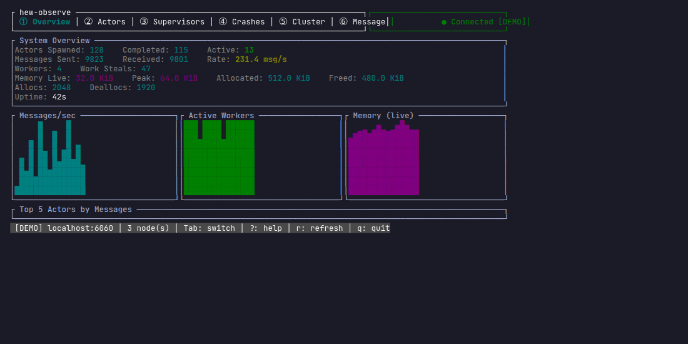
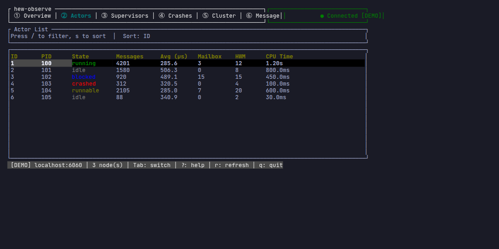
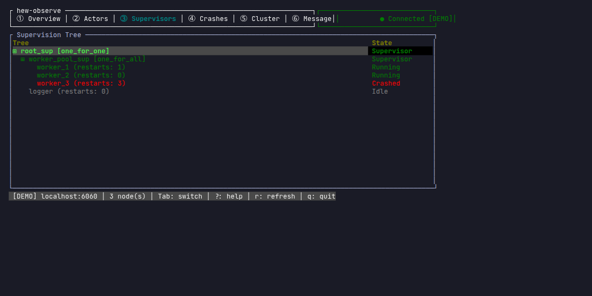
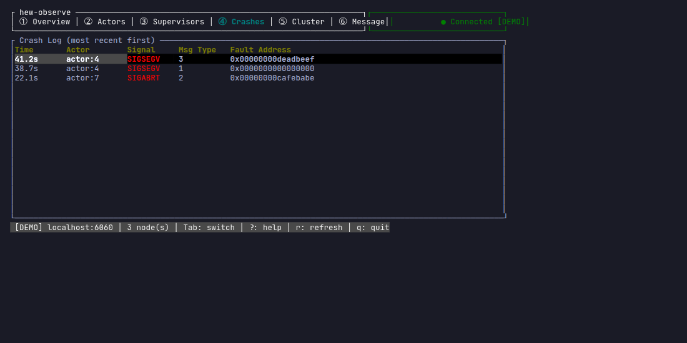
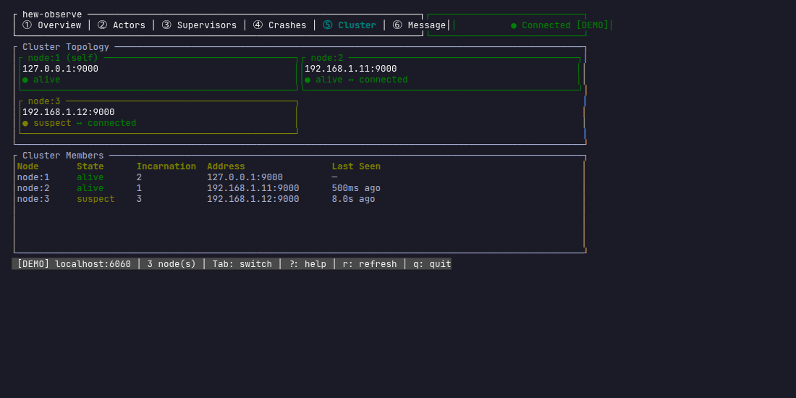
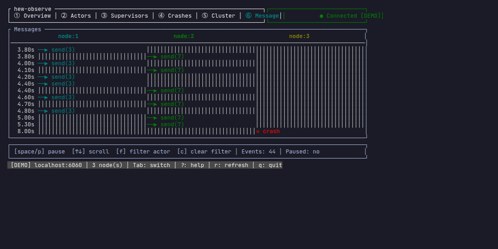
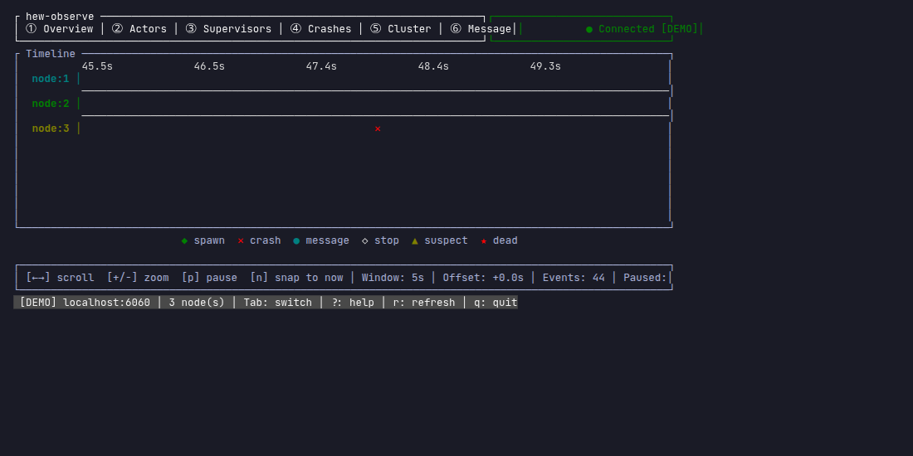

# hew-observe

TUI dashboard for debugging Hew actor systems in real time.

Connects to a running Hew program's built-in profiler endpoint and displays:

- Live actor count and message throughput
- Per-actor mailbox depth and processing latency
- Actor group hierarchy and supervisor trees
- Memory allocation stats

## Screens

The observer organizes its views into seven tabs. Switch with `Tab` / `Shift+Tab`
or the number keys `1`–`7`.

### 1. Overview — system health at a glance



Top-level counters: actor count, messages processed, mailbox pressure, memory
use, and uptime. Start here to sanity-check that a program is alive and
making progress.

### 2. Actors — per-actor detail



One row per actor: mailbox depth, processed-message count, and recent
processing latency. Sort and scroll to find hot spots or stuck actors.

### 3. Supervisors — supervision tree



Actor group hierarchy and supervisor trees. Shows restart counts and the
parent-child relationships that define failure handling.

### 4. Crashes — failure log



Rolling log of actor crashes with the failing actor, its supervisor's
restart decision, and the surrounding context.

### 5. Cluster — node view



Multi-node view for clustered deployments: per-node connection state,
message flow across nodes, and distributed actor placement.

### 6. Messages — message flow



Live message traffic between actors, with source, destination, kind, and
recent rate.

### 7. Timeline — temporal view



Time-ordered trace of scheduler and mailbox events so causality and
ordering are visible at a glance.

## Usage

```sh
# Start your Hew program with profiling enabled (auto unix-socket discovery)
hew run myapp.hew --profile

# In another terminal, attach the observer (auto-discovers on Unix)
hew-observe

# Or target a specific TCP address
hew-observe --addr localhost:6060

# List all discovered profiler processes (Unix only)
hew-observe --list

# If multiple profilers are running, pick one explicitly (Unix only)
hew-observe --pid 12345
```

You can also run an already-compiled binary directly without `hew run`:

```sh
HEW_PPROF=auto ./myapp      # Unix: per-user socket, auto-discovered
HEW_PPROF=:6060 ./myapp     # TCP on port 6060
hew-observe                 # or: hew-observe --addr localhost:6060
```

## Part of the Hew compiler

This crate is an internal component of the [Hew](https://github.com/hew-lang/hew) compiler toolchain.

## Discovery order

On Unix, `hew-observe` resolves the profiler socket directory in this order:

1. `$XDG_RUNTIME_DIR/hew-profilers/` (Linux, if `$XDG_RUNTIME_DIR` is set)
2. `$TMPDIR/hew-profilers-{uid}/` (macOS / BSD, if `$TMPDIR` is set)
3. `/tmp/hew-profilers-{uid}/` (fallback)

The Hew runtime writes a JSON descriptor (`{pid}.json`) to whichever
directory it chooses.  `hew-observe` reads from the first directory that
exists and is owned by your UID.  Stale entries (processes that are no longer
alive) are pruned automatically on the next scan.

## Troubleshooting

**No profiler discovered at startup?**

The observer starts in *waiting mode* and displays an informative splash
screen.  It rescans the discovery directory every **3 seconds** and will
auto-connect as soon as a profiler appears — no restart required.  The
status bar shows `[WAITING]` and the connection indicator shows
`◌ Waiting for profiler…` while scanning.

Run `hew-observe --list` to check what is currently visible.

Make sure the Hew program was started with profiling enabled:

```sh
hew run myapp.hew --profile
# or
HEW_PPROF=auto ./myapp
```

**"Multiple profilers running" error?**

Use `hew-observe --list` to see all active profilers, then pick one:

```sh
hew-observe --list        # shows PID, program name, uptime, socket path
hew-observe --pid 12345   # attach to that specific PID
```

**"No profiler found for PID …" error?**

The process may have exited or profiling may not be enabled.  Check with
`hew-observe --list` to see what is currently available.

**On non-Unix platforms (Windows)?**

Automatic discovery is not available.  Use `--addr` to specify the profiler
address explicitly:

```sh
HEW_PPROF=:6060 myapp.exe
hew-observe --addr localhost:6060
```
